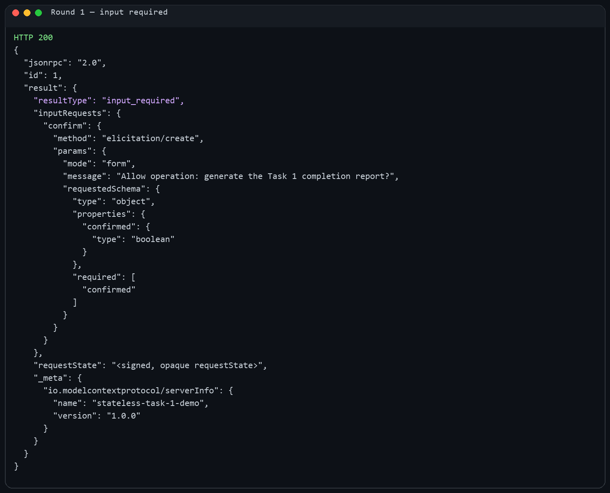
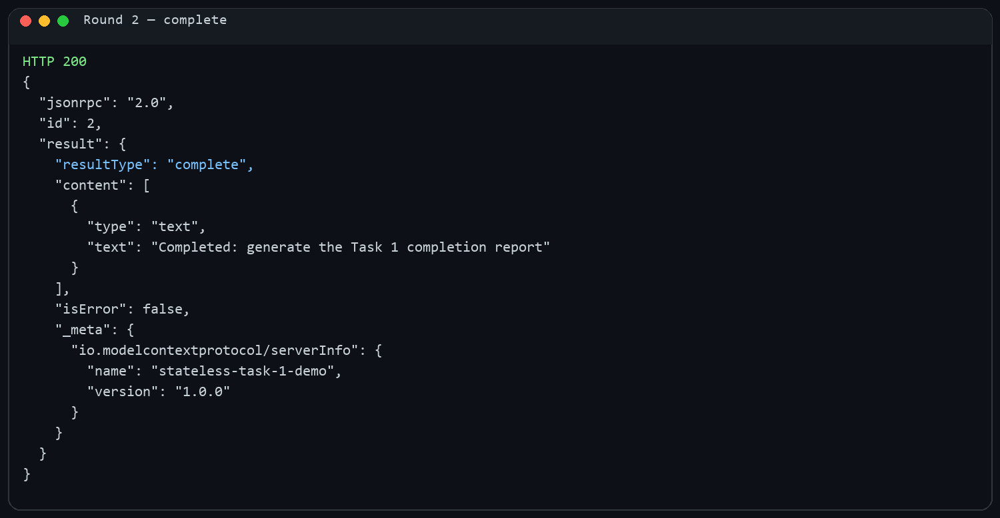
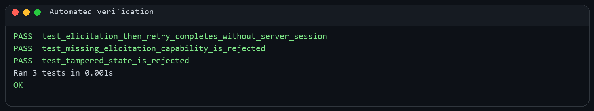

# Stateless MCP — Task 1

[](https://www.python.org/)
[](https://modelcontextprotocol.io/)
[](#automated-verification)

A dependency-free Python implementation of the stateless-first concepts in
[SEP-2575: Make MCP Stateless](https://modelcontextprotocol.io/seps/2575-stateless-mcp).
It demonstrates per-request negotiation, capability discovery, elicitation,
multi-round-trip requests, signed request state, and final special responses.

## Why stateless MCP?

Traditional MCP sessions retain negotiated state on a particular server.
Stateless MCP makes each request independently understandable, allowing any
healthy server replica to process it without sticky sessions.

| Stateful concern | Stateless approach in this project |
|---|---|
| Initialization handshake | Version and capabilities travel with every request |
| Server-side session memory | Signed `requestState` is echoed by the client |
| Mid-call server request | `input_required` embeds `elicitation/create` |
| Resume a broken exchange | Client retries with a new JSON-RPC request ID |

## Architecture

```text
Client                                      Stateless server
  │ tools/call: id=1 + metadata/capabilities       │
  ├────────────────────────────────────────────────>│
  │       input_required + elicitation + state      │
  │<────────────────────────────────────────────────┤
  │ collect human confirmation                      │
  │ tools/call: id=2 + response + echoed state      │
  ├────────────────────────────────────────────────>│
  │                     complete result              │
  │<────────────────────────────────────────────────┤
```

## Implemented concepts

- `server/discover` for versions and server capabilities.
- Required `MCP-Protocol-Version`, `Mcp-Method`, and `Mcp-Name` headers.
- Per-request protocol version, client identity, and capabilities in `_meta`.
- Form elicitation through an embedded `elicitation/create` request.
- `resultType: "input_required"` followed by `resultType: "complete"`.
- HMAC-SHA256 signed, expiring `requestState` bound to tool arguments.
- Errors for mismatched headers, unsupported versions, missing capabilities,
  malformed requests, modified state, and unknown methods.

## Output walkthrough

### 1. Server requests input



The initial `tools/call` does not block while waiting for the user. The server
returns an `input_required` result containing an elicitation schema and a signed,
opaque `requestState`, then finishes the HTTP exchange.

### 2. Client retries and completes



After confirmation, the client sends a new JSON-RPC request containing the same
tool arguments, the elicitation answer, and the byte-for-byte state token. The
server verifies both state integrity and argument binding before completing.

### Automated verification



The tests verify the successful two-round flow, capability enforcement, and
rejection of a modified `requestState` token.

## Run locally

The Task 1 implementation uses only Python's standard library.

Start the server:

```powershell
$env:MCP_STATE_SECRET = "replace-with-a-long-random-secret"
python server.py
```

In another terminal, start the client:

```powershell
python demo_client.py
```

Answer `y` at the confirmation prompt. Then run the tests:

```powershell
python -m unittest discover -s tests -v
```

## In-flight rules

1. A 2026 server does not push `elicitation/create` as a separate JSON-RPC
   request during a tool call. It embeds the request in an `input_required`
   result and finishes that HTTP exchange.
2. The retry is a new request with a new request ID. It repeats the original
   method and arguments and includes only the current round's `inputResponses`.
3. Any cross-round knowledge travels in `requestState`, never in server memory.
   Because clients can inspect or modify that value, it must be integrity
   protected, short-lived, and bound to the original operation.
4. The server may only request features declared in that request's client
   capabilities. It cannot remember capabilities from an earlier request.
5. Closing an HTTP response stream cancels that in-flight request. Broken
   streams are not resumed; the client issues a new request instead.

## Project structure

```text
.
├── assets/                       # Generated output evidence
├── scripts/generate_screenshots.py
├── tests/test_stateless_mcp.py   # Protocol and security tests
├── stateless_mcp.py              # Stateless MCP core
├── server.py                     # HTTP entry point
├── demo_client.py                # Interactive two-round client
├── client.py                     # Short compatibility entry point
└── README.md
```

## Security notes

- Set `MCP_STATE_SECRET` to a long random secret outside local demonstrations.
- Share the same secret across replicas so any worker can validate a retry.
- Keep tokens short-lived and bind them to the original method and arguments.
- Treat `inputResponses` and `requestState` as untrusted client input.
- Authenticate and authorize every request independently in production.

## References

- [SEP-2575: Make MCP Stateless](https://modelcontextprotocol.io/seps/2575-stateless-mcp)
- [MCP 2026-07-28 tool and input-required specification](https://github.com/modelcontextprotocol/modelcontextprotocol/blob/main/docs/specification/2026-07-28/server/tools.mdx)
- [MCP Python SDK](https://github.com/modelcontextprotocol/python-sdk)

## Scope

This is an educational wire-level implementation focused on Task 1. Production
servers should use an official MCP SDK for complete schema validation, SSE,
authentication, subscriptions, cancellation, and compatibility behavior.
