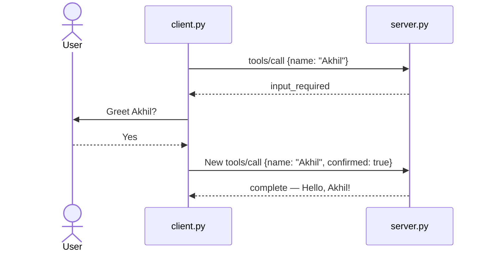

# 🔌 Simple Stateless MCP Demo

[](https://www.python.org/)
[](https://modelcontextprotocol.io/)

A small Python project that explains stateless MCP with one tool:
`greet`. The server asks for confirmation, the client replies in a new
self-contained request, and the server returns the greeting.

## 📁 Project structure

```text
stateless-mcp-python-demo/
│
├── server.py
├── client.py
├── requirements.txt
├── README.md
└── .gitignore
```

| File | Purpose |
|---|---|
| `server.py` | HTTP server and the `greet` tool |
| `client.py` | Sends the two independent JSON-RPC requests |
| `requirements.txt` | Shows that no third-party packages are needed |
| `README.md` | Setup and explanation |
| `.gitignore` | Ignores local Python and editor files |

## 🧠 What is MCP?

Model Context Protocol (MCP) is a standard way for AI applications to connect
to tools and data. A client sends JSON-RPC messages to an MCP server. The
server can expose tools, resources, and reusable prompts.

## 🚀 Why stateless?

An older stateful flow starts with a handshake and can keep negotiated session
information on one server. In a stateless flow, every request contains what the
server needs, so the next request can be handled independently.

This demo stores no client session:

1. The client calls `greet` with a name.
2. The server returns `input_required`.
3. The client asks the user for confirmation.
4. The client sends a new request with the name and confirmation.
5. The server returns `complete`.

## 🗺️ Architecture



Each arrow from the client to the server is a complete HTTP request. The server
does not need memory from the previous request.

## ▶️ Run the demo

Requirements:

- Python 3.10 or newer
- No external packages

Start the server:

```powershell
python server.py
```

Open another terminal and run:

```powershell
python client.py
```

Enter `y` when asked:

```text
Greet Akhil? [y/N] y
```

The final response contains:

```json
{
  "resultType": "complete",
  "content": [
    {
      "type": "text",
      "text": "Hello, Akhil!"
    }
  ]
}
```

## 🔍 Where to look in the code

- `server.py → handle()`: processes one request without a session.
- `server.py → MCPHandler`: receives JSON over `POST /mcp`.
- `client.py → call()`: creates and sends a JSON-RPC request.
- `client.py → main()`: demonstrates the two-round interaction.

## 🎤 Quick interview questions

### What makes this server stateless?

It does not save client-specific data between requests. The retry repeats the
tool name and arguments and adds the user's confirmation.

### Is `input_required` an error?

No. It is an intermediate result telling the client that user input is needed
before the tool can complete.

### Why is stateless MCP easier to scale?

Any available server instance can process a complete request. A load balancer
does not need to route every request back to a server holding session data.

### What protocol carries the messages?

The demo uses JSON-RPC 2.0 over HTTP and includes the MCP protocol version in
the `MCP-Protocol-Version` header.

## 📖 Reference

- [SEP-2575: Make MCP Stateless](https://modelcontextprotocol.io/seps/2575-stateless-mcp)

> This is a deliberately small learning example. Production MCP systems should
> use an official SDK and add authentication, schema validation, authorization,
> secure state handling, and complete protocol error handling.
