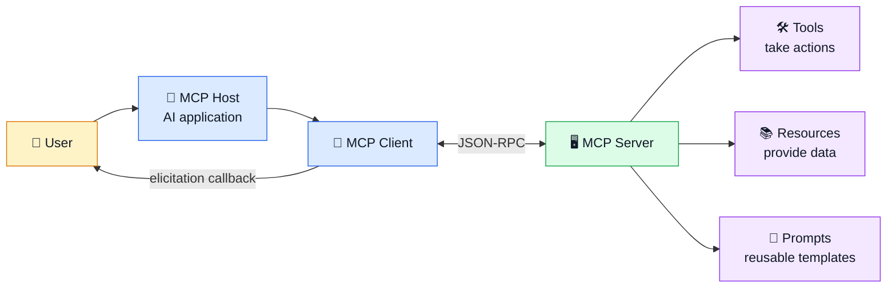
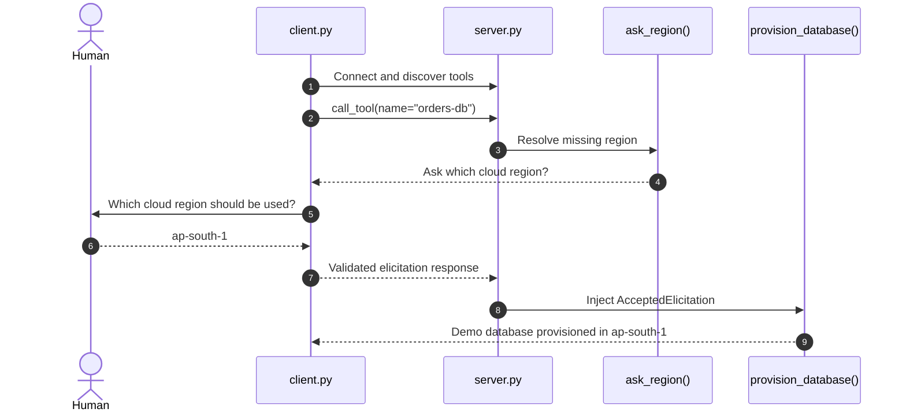
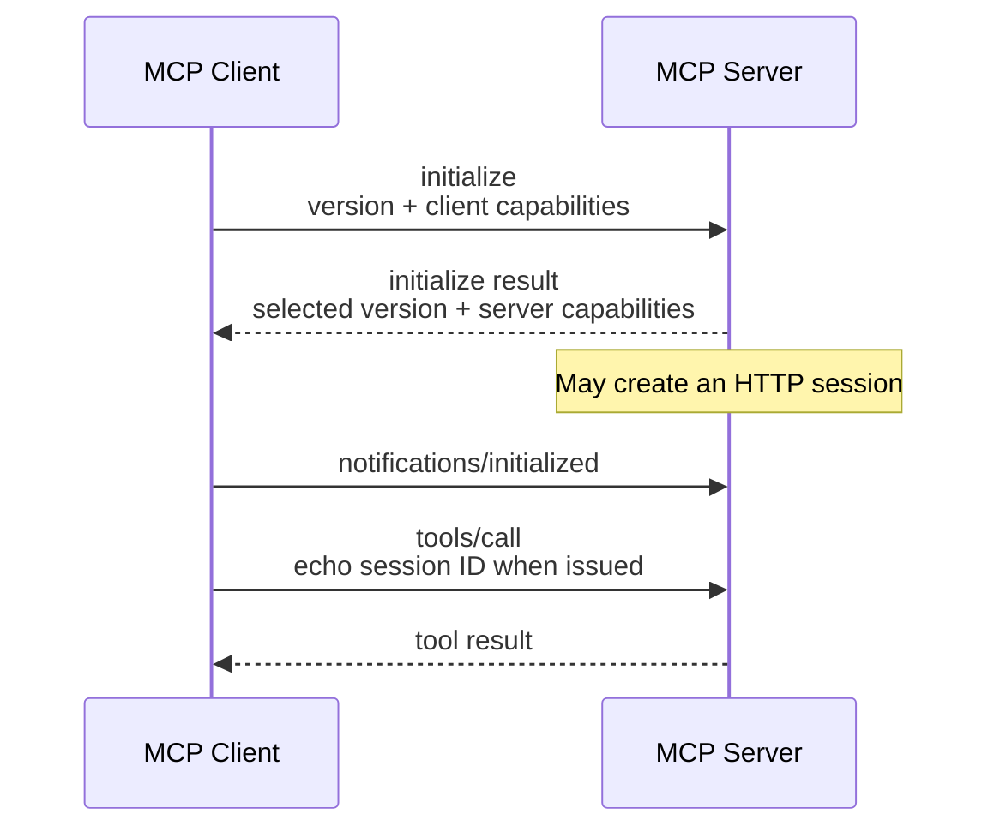
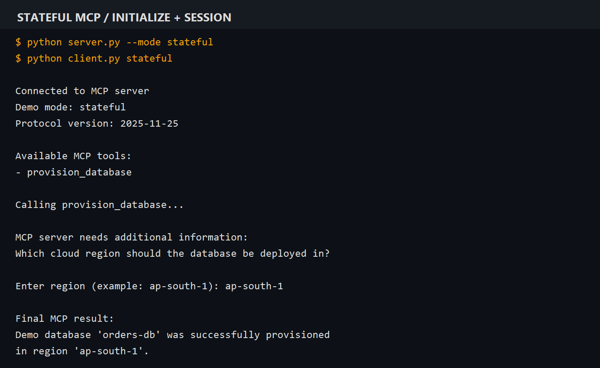
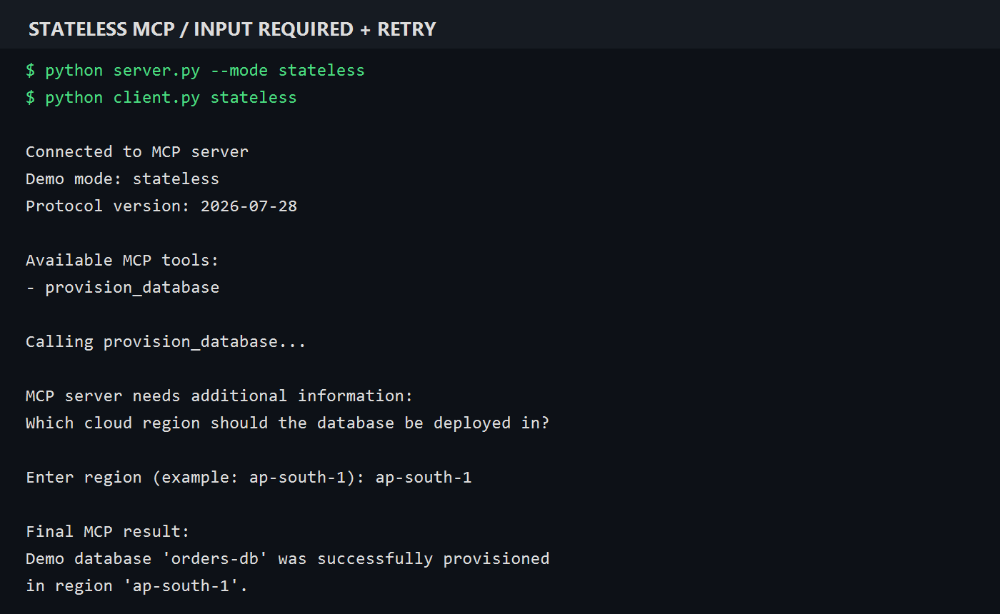

# 🗄️ Stateless MCP + Human Elicitation Demo

[](https://www.python.org/)
[](https://github.com/modelcontextprotocol/python-sdk)
[](#security-and-scope)

[](#what-is-mcp)
[](#how-the-demo-works)
[](#why-stateless-mcp)
[](#common-interview-questions)

This beginner-friendly project uses the official MCP Python SDK v2 to run the
same human-in-the-loop tool through both the legacy stateful handshake and the
modern stateless protocol. The client supplies a database name; the server asks
the human which cloud region to use; then the tool returns a demo result.

> 🧪 **No real cloud database is created.** This project demonstrates protocol
> behavior only.

## 📁 Project structure

```text
stateless-mcp-python-demo/
├── assets/
│   ├── stateful-elicitation-output.png
│   └── stateless-elicitation-output.png
├── server.py          # MCP tool, resolver, and HTTP server
├── client.py          # Tool discovery and human elicitation callback
├── requirements.txt   # MCP SDK v2 and its direct dependencies
├── README.md          # Setup, diagrams, and learning guide
└── .gitignore         # Local environment and editor files
```

## 🧠 What is MCP?

**Model Context Protocol (MCP)** is an open standard that connects AI
applications to tools and information through a shared protocol. It uses
JSON-RPC messages so a compatible host can work with many different servers.

### MCP architecture



## 👋 How the demo works

The `provision_database` tool accepts a name from the client. Its
`region_choice` parameter is marked with `Resolve(ask_region)`, so the
region is hidden from the model-facing tool arguments and obtained through
human elicitation instead. The server and client each accept a mode so you can
compare both protocol generations with the same tool.

1. Start the server in either stateful or stateless mode.
2. The client discovers the server's tools.
3. The client calls `provision_database(name="orders-db")`.
4. The resolver returns an `Elicit` form asking which region to use.
5. The client callback displays the question and collects the human's answer.
6. The SDK resumes the tool and validates the region with Pydantic.
7. The tool returns a demo success, decline, or cancellation message.



### Resolver result handling

| Human action | SDK result | Demo behavior |
|---|---|---|
| Accepts with a region | `AcceptedElicitation` | Returns the selected region |
| Declines | `DeclinedElicitation` | Reports that provisioning did not happen |
| Cancels | `CancelledElicitation` | Reports that the operation was cancelled |

The client callback must be registered with `elicitation_callback=`. That
registration tells the server that this client can ask the human.

## 🤝 How the older stateful handshake worked

Handshake-era protocol versions such as `2025-11-25` establish context before
normal operations:

1. Client sends `initialize` with its protocol version and capabilities.
2. Server replies with the selected version and its capabilities.
3. Client sends `notifications/initialized`.
4. Client sends regular operations such as `tools/list` and `tools/call`.

With Streamable HTTP, the server could also issue an `Mcp-Session-Id` that
clients echoed on later requests. That session is separate from the three
initialization messages, though the two often appear together.



### ▶️ Run the stateful handshake

Start the server:

```powershell
python server.py --mode stateful
```

In a second terminal, run the client:

```powershell
python client.py stateful
```

The client explicitly selects legacy mode, so the SDK performs
`initialize → initialize result → notifications/initialized`. The stateful
server keeps a session and a request channel while the human answers the
elicitation.



## 🚀 Why stateless MCP?

The `2026-07-28` protocol revision removes the initialization handshake and
the protocol-level `Mcp-Session-Id`. Clients can discover server information
with `server/discover`, and include protocol context with each request.
Multi-round operations can return `input_required`; the client supplies the
answer in a new request.

| Stateful pattern | Stateless pattern |
|---|---|
| Negotiate once during initialization | Include current context per request |
| Later requests may depend on a session | Process requests independently |
| May need sticky load-balancer routing | Any healthy worker can handle the request |
| User interaction uses the session channel | Return input-required state and continue on a new request |

### 🔀 Same tool, different wire flow

```mermaid
flowchart TB
    subgraph LEGACY[🤝 Stateful · 2025-11-25]
        direction LR
        L1[initialize] --> L2[server creates session]
        L2 --> L3[initialized notification]
        L3 --> L4[tool call]
        L4 --> L5[server asks client on session channel]
        L5 --> L6[tool completes]
    end

    subgraph MODERN[🚀 Stateless · 2026-07-28]
        direction LR
        M1[tool call] --> M2[input_required result]
        M2 --> M3[client asks human]
        M3 --> M4[new request includes answer]
        M4 --> M5[tool completes on any worker]
    end
```



Stateless protocol behavior makes independent request routing easier. It does
not prevent an application from storing durable data in a database. Any state
needed to continue an operation must be available to whichever worker handles
the next request.

### ▶️ Run the stateless flow

Start the default stateless server:

```powershell
python server.py --mode stateless
```

In another terminal:

```powershell
python client.py stateless
```

The SDK negotiates `2026-07-28`. The resolver returns `input_required`;
the client gathers the answer and the SDK continues with a new, self-contained
request. No persistent HTTP session is used.



## ▶️ Run locally

Use Python 3.10 or newer. From the project directory, create and activate a
virtual environment, then install the dependencies:

```powershell
python -m venv .venv
.venv\Scripts\Activate.ps1
python -m pip install -r requirements.txt
```

Choose one matching server/client mode from the sections above. The stateless
mode is the default:

```powershell
python server.py
```

Run the client in a second terminal:

```powershell
python client.py stateless
```

When prompted, enter a region such as `ap-south-1`. The expected final line
looks like:

```text
Demo database 'orders-db' was successfully provisioned in region 'ap-south-1'.
```

## 🔍 Code walkthrough

- `server.py → RegionChoice`: defines the form field and its description.
- `server.py → ask_region()`: describes the question presented to the human.
- `server.py → provision_database()`: handles accepted, declined, and
  cancelled outcomes.
- `server.py → mcp.run()`: selects stateless JSON responses or the stateful
  session transport based on `--mode`.
- `client.py → handle_elicitation()`: gathers the human's answer.
- `client.py → main()`: connects, discovers tools, calls the tool, and prints
  the result.

## 🎤 Common interview questions

<details>
<summary><strong>1. What is MCP?</strong></summary>

**Answer:** MCP is a standard protocol that lets AI applications connect to
external capabilities such as tools, resources, and prompts.

**Example:** A database MCP server can expose a safe query tool to different
compatible AI hosts without creating a different integration for each host.

</details>

<details>
<summary><strong>2. What is elicitation?</strong></summary>

**Answer:** Elicitation lets an MCP server request information from a human
through the client while handling an operation.

**In this demo:** The server asks the person to choose a cloud region instead
of allowing the model to guess.

</details>

<details>
<summary><strong>3. What does <code>Resolve</code> do?</strong></summary>

**Answer:** It tells the SDK to obtain a tool parameter through a resolver
function. The parameter is not supplied directly by the model.

**Example:** `Resolve(ask_region)` runs the resolver and injects its result
into `region_choice`.

</details>

<details>
<summary><strong>4. What does the default stateful handshake do?</strong></summary>

**Answer:** The client sends `initialize`; the server selects a protocol
version and returns capabilities; the client sends
`notifications/initialized`; then normal requests begin.

**Solution:** Remember it as “initialize request, initialize response, ready
notification.”

</details>

<details>
<summary><strong>5. Why does a stateful session complicate scaling?</strong></summary>

**Answer:** A later request may rely on context held by the worker that handled
initialization. A load balancer needs sticky routing or shared session storage
to make that context available.

</details>

<details>
<summary><strong>6. What changes in stateless MCP?</strong></summary>

**Answer:** In the `2026-07-28` revision, the initialization handshake and
protocol session ID are removed. Requests carry their current protocol context,
so each can be handled independently.

</details>

<details>
<summary><strong>7. What is <code>input_required</code>?</strong></summary>

**Answer:** It is an intermediate response saying more input is needed to
finish an operation. It is not an error. The client collects input and sends a
new request to continue.

</details>

<details>
<summary><strong>8. What if the user declines or cancels?</strong></summary>

**Answer:** The tool should handle both outcomes explicitly. The SDK exposes
`DeclinedElicitation` and `CancelledElicitation`; accepted data is available
through `AcceptedElicitation.data`.

</details>

<details>
<summary><strong>9. Does stateless MCP mean an application cannot store data?</strong></summary>

**Answer:** No. It removes hidden protocol-session dependencies. Applications
may still store durable business data or explicit operation state.

</details>

<details>
<summary><strong>10. Does this demo provision a real database?</strong></summary>

**Answer:** No. It returns a message to demonstrate the MCP flow. A production
provisioning tool would need cloud authentication, authorization, validation,
error handling, and careful user confirmation.

</details>

## 🔐 Security and scope

- This project never creates or modifies cloud resources.
- Do not add cloud credentials to the source code or commit them to GitHub.
- A real provisioning tool must authenticate and authorize every operation.
- Elicitation answers are user input; validate them before using them.

## 📖 References

- [Official MCP Python SDK](https://github.com/modelcontextprotocol/python-sdk)
- [SDK v2 elicitation guide](https://github.com/modelcontextprotocol/python-sdk/blob/main/docs/handlers/elicitation.md)
- [MCP architecture — 2025-11-25](https://modelcontextprotocol.io/specification/2025-11-25/architecture)
- [MCP lifecycle — 2025-11-25](https://modelcontextprotocol.io/specification/2025-11-25/basic/lifecycle)
- [SEP-2575: Make MCP Stateless](https://modelcontextprotocol.io/seps/2575-stateless-mcp)
