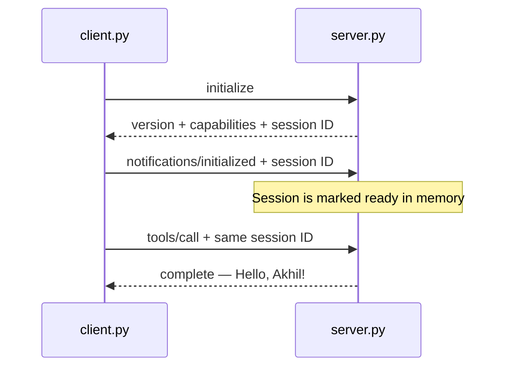
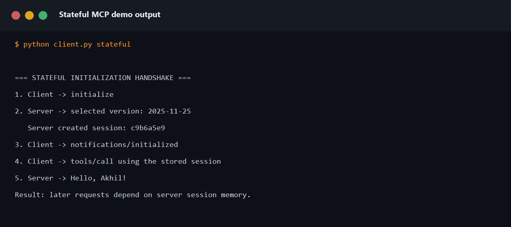
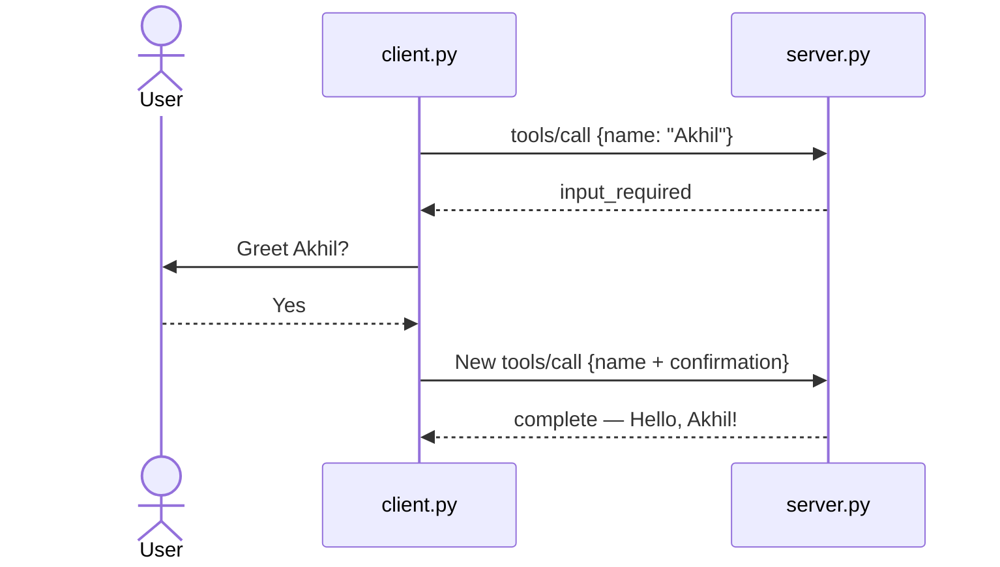
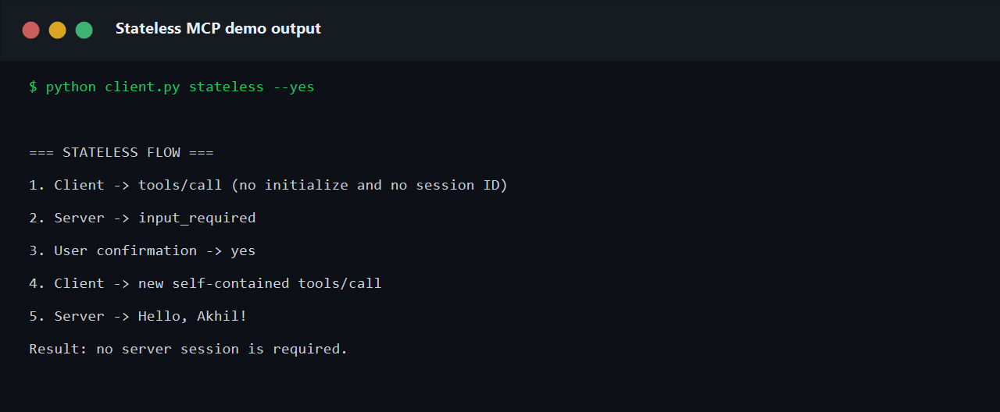
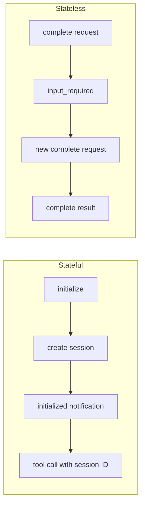

# 🔌 Stateful vs Stateless MCP Demo

[](https://www.python.org/)
[](https://modelcontextprotocol.io/)

A small, dependency-free Python project that demonstrates both the older
stateful initialization handshake and the newer stateless MCP request flow.
Both examples call the same `greet` tool and return `Hello, Akhil!`.

## 📁 Project structure

```text
stateless-mcp-python-demo/
│
├── assets/
│   ├── stateful-handshake.png
│   └── stateless-flow.png
├── server.py
├── client.py
├── requirements.txt
├── README.md
└── .gitignore
```

The implementation remains intentionally small:

- `server.py` contains both server flows and the `greet` tool.
- `client.py` runs the stateful, stateless, or both demonstrations.
- `assets/` contains screenshots captured from successful local runs.
- No third-party packages are required.

## 🧠 What is MCP?

Model Context Protocol (MCP) is a standard way for AI applications to connect
to tools and data. A client and server exchange JSON-RPC messages. The server
can expose tools, resources, and reusable prompts.

## ⚖️ Stateful vs stateless

| Topic | Stateful initialization | Stateless MCP |
|---|---|---|
| First step | Three-message handshake | Directly send the request |
| Context | Server remembers a session | Every request carries its context |
| Routing | Later calls may need the same server | Any available server can handle a request |
| Recovery | Lost session may require initialization again | Send another complete request |
| Scaling | May require sticky sessions | Works naturally behind a load balancer |

## 🤝 Stateful initialization handshake

The stateful demonstration uses the `2025-11-25` protocol version:

1. The client sends `initialize` with its version and capabilities.
2. The server selects a version and returns its capabilities.
3. The server creates an in-memory session ID.
4. The client sends `notifications/initialized`.
5. The client calls the tool using the same session ID.



### Stateful output



The screenshot shows that the server creates `c9b6a5e9` for this captured
run. A new run creates a different value. The later tool call depends on that
session still existing in the server's `SESSIONS` dictionary.

## 🚀 Stateless MCP flow

The stateless demonstration uses the `2026-07-28` protocol version:

1. The client directly calls `greet`; no `initialize` request is sent.
2. The server returns `input_required`.
3. The user confirms the action.
4. The client sends a new request containing the tool arguments and answer.
5. The server returns `complete`.



### Stateless output



The second request is self-contained. It repeats the tool name and arguments
and adds the user's answer, so the server needs no client session.

## 🔄 Flow comparison



The key difference is not whether an application may use a database. It is
whether a protocol request depends on hidden client-specific state retained
from an earlier exchange.

## ▶️ Run locally

Start the server:

```powershell
python server.py
```

In another terminal, run only the stateful handshake:

```powershell
python client.py stateful
```

Run only the stateless flow:

```powershell
python client.py stateless
```

Or run both and automatically confirm the prompt:

```powershell
python client.py both --yes
```

## 🔍 Where to look in the code

- `server.py → handle()`: contains the two clearly separated server paths.
- `server.py → SESSIONS`: shows the memory required by the stateful example.
- `client.py → stateful_demo()`: performs the three-message handshake.
- `client.py → stateless_demo()`: sends independent requests without a session.

## 🎤 Quick interview questions

### What happens during the stateful initialization handshake?

The client proposes its protocol version and capabilities, the server returns
the selected version and its capabilities, and the client sends
`notifications/initialized` before normal operations.

### What makes the second example stateless?

It does not create or reuse a session ID. The retry includes the original tool
arguments and the user's response, so it can be processed independently.

### Is `input_required` an error?

No. It is an intermediate result telling the client to collect input before
sending a new request.

### Why does stateless MCP scale more easily?

A load balancer can route each complete request to any healthy worker. It does
not need sticky routing to a worker holding the earlier session.

## 📖 References

- [SEP-2575: Make MCP Stateless](https://modelcontextprotocol.io/seps/2575-stateless-mcp)
- [MCP specification](https://modelcontextprotocol.io/specification/)

> This is a deliberately small teaching implementation. Production MCP systems
> should use an official SDK and add authentication, authorization, complete
> schema validation, secure state handling, and full protocol error behavior.
