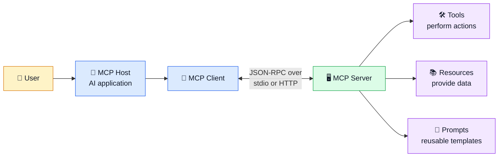
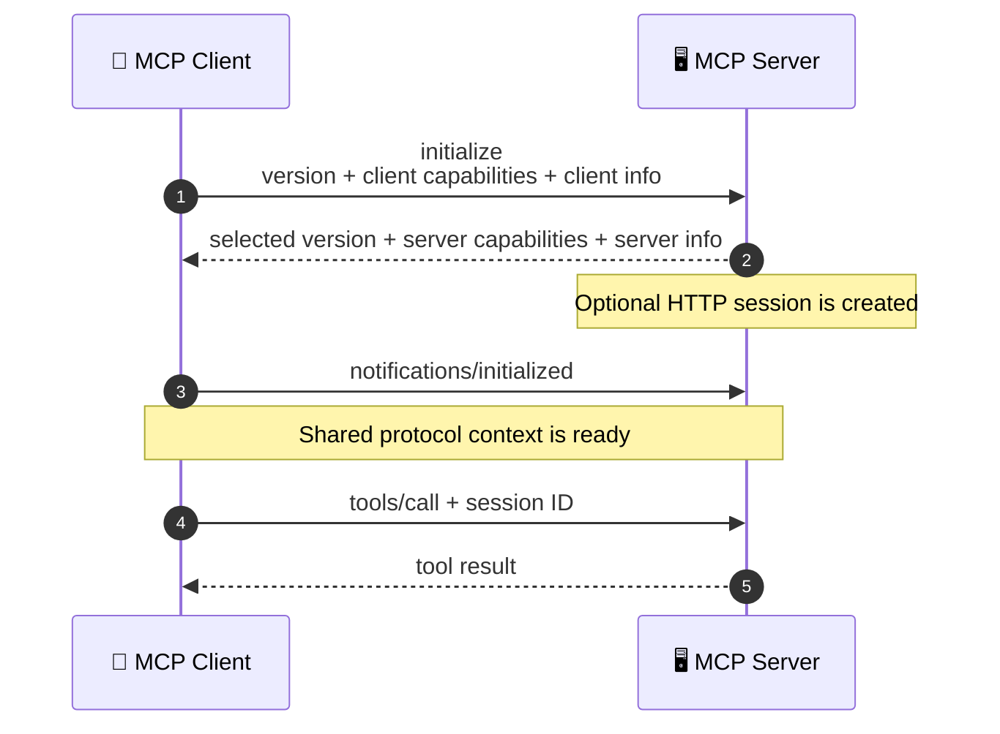
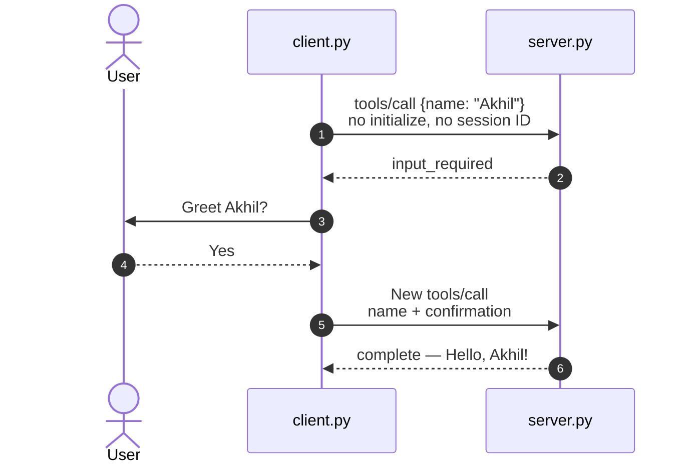
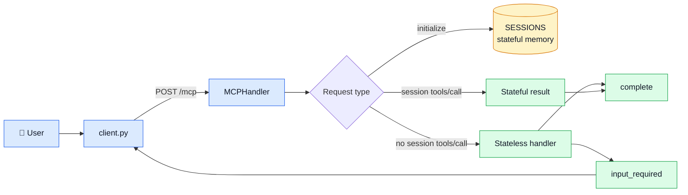
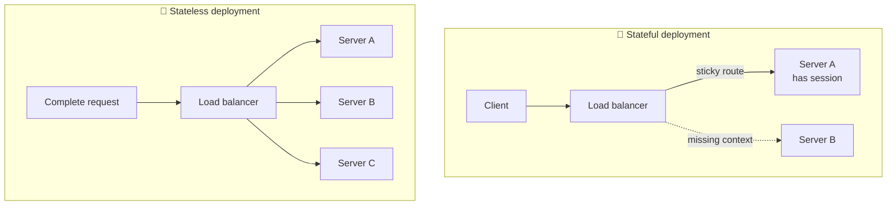

# 🔌 Stateful vs Stateless MCP Demo

[](https://www.python.org/)
[](https://modelcontextprotocol.io/)
[](requirements.txt)

[](#mcp-basics)
[](#default-handshake)
[](#why-stateless)
[](#interview-prep)

A small, dependency-free Python project that demonstrates both the default
stateful initialization handshake and the newer stateless MCP request flow.
Both examples call the same `greet` tool and return `Hello, Akhil!`.

> 🧭 **Learning path:** MCP basics → default handshake → handshake limitations
> → stateless MCP → working output → interview questions.

## 📁 Project structure

```text
stateless-mcp-python-demo/
│
├── assets/
│   ├── stateful-handshake.png
│   └── stateless-flow.png
├── server.py
├── client.py
├── requirements.txt
├── README.md
└── .gitignore
```

| File | Purpose |
|---|---|
| `server.py` | HTTP server, session demo, and stateless `greet` tool |
| `client.py` | Runs either comparison flow or both |
| `assets/` | Verified terminal-output screenshots |
| `requirements.txt` | Confirms that no third-party packages are needed |

<a id="mcp-basics"></a>

## 🧠 What is MCP?

**Model Context Protocol (MCP)** is an open standard that connects AI
applications to external tools and information through a common protocol.
Instead of building a different custom integration for every application, an
MCP host communicates with MCP servers using JSON-RPC messages.

### MCP ecosystem architecture



| Component | Responsibility |
|---|---|
| 🤖 **Host** | Runs the AI experience, permissions, and user interaction |
| 🔌 **Client** | Maintains communication with one MCP server |
| 🖥️ **Server** | Exposes focused capabilities through MCP |
| 🛠️ **Tools** | Executable actions such as APIs, searches, or file operations |
| 📚 **Resources** | Contextual data such as files or database records |
| 🧾 **Prompts** | Reusable interaction templates |

<a id="default-handshake"></a>

## 🤝 How the default stateful handshake takes place

In handshake-era MCP revisions such as `2025-11-25`, normal operations begin
only after the client and server establish shared protocol context:

1. **Client → Server: `initialize`**
   The client proposes a protocol version and declares its capabilities and
   implementation information.
2. **Server → Client: initialize result**
   The server selects the version and returns its capabilities and server
   information. With Streamable HTTP, it may also issue an
   `Mcp-Session-Id`.
3. **Client → Server: `notifications/initialized`**
   The client confirms that initialization is complete.
4. **Normal operations begin**
   The client can now call methods such as `tools/list` and `tools/call`.
   When a session ID was issued, later HTTP requests must echo it.



### ✅ Working stateful output


The captured run creates session `c9b6a5e9`. Each new run generates another
value. In this teaching server, the later tool call succeeds only while that
session exists in the in-memory `SESSIONS` dictionary.

> 📌 **Important:** The initialization lifecycle and an HTTP session are
> related but distinct. A stateful server may choose whether to issue a
> session ID; this demo issues one so the dependency is easy to observe.

<a id="why-stateless"></a>

## 🚀 Why stateless MCP?

The handshake model works, but it makes distributed deployments harder when
later requests depend on state held by a specific server process.

### Challenges with stateful protocol sessions

- 🧲 A load balancer may need **sticky routing** to the original worker.
- 🗄️ Multiple workers may need a **shared session store**.
- 🔄 A restart can discard session context and force reconnection.
- 📈 Autoscaling and failover require more coordination.
- 🧪 Reproducing a request is harder when some required context is hidden.

The `2026-07-28` revision removes the mandatory initialization handshake and
the protocol-level `Mcp-Session-Id`. Clients can use `server/discover` when
they need server information, while request-specific version and capability
context travels with requests. Multi-round operations return
`input_required`; the client supplies the answer in a new request.

| Stateful concern | Stateless approach |
|---|---|
| Negotiate once, remember later | Send required context per request |
| Session ID connects requests | No protocol session ID |
| Same worker may be required | Any healthy worker can process the request |
| Mid-call interaction depends on a connection | Return `input_required`, then retry |
| Lost session requires recovery | Resend a complete request |

### Stateless request sequence



### ✅ Working stateless output


The retry repeats the tool and arguments and adds the user's answer. The server
does not need client-specific memory from the earlier HTTP request.

## 🏗️ Repository architecture



### Scaling comparison



> 🧩 **Stateless protocol ≠ stateless application.** An application may still
> use databases or durable job state. The difference is that a request does
> not depend on hidden protocol session context from an earlier exchange.

## ▶️ Run locally

Start the server:

```powershell
python server.py
```

Open another terminal and choose a demonstration:

```powershell
# Default stateful initialization handshake
python client.py stateful

# Stateless flow with interactive confirmation
python client.py stateless

# Run both flows and answer confirmation automatically
python client.py both --yes
```

## 🔍 Code walkthrough

- `server.py → handle()` separates the stateful and stateless paths.
- `server.py → SESSIONS` exposes the memory required by the stateful demo.
- `server.py → MCPHandler` receives JSON-RPC through `POST /mcp`.
- `client.py → stateful_demo()` performs the initialization lifecycle.
- `client.py → stateless_demo()` sends independent requests without a session.

<a id="interview-prep"></a>

## 🎤 Common interview questions with solutions

<details>
<summary><strong>1. What problem does MCP solve?</strong></summary>

**Answer:** MCP gives AI applications a standard interface for discovering and
using tools, resources, and prompts. It reduces the need for a different
integration contract for every host and external system.

**Solution example:** A weather MCP server can expose one `get_forecast` tool
that multiple compatible AI hosts can discover and call.

</details>

<details>
<summary><strong>2. What is the difference between an MCP host, client, and server?</strong></summary>

**Answer:** The host is the user-facing AI application. It creates an MCP
client for each server connection. The server exposes focused capabilities
such as tools and resources.

**Memory aid:** Host = coordinator, client = connection, server = capability
provider.

</details>

<details>
<summary><strong>3. What are the messages in the default initialization handshake?</strong></summary>

**Answer:** The client sends `initialize`; the server returns the selected
version and capabilities; the client sends `notifications/initialized`.
Normal operations follow.

**Solution:** Explain it as “request, response, ready notification,” then draw
the three arrows shown in the sequence diagram above.

</details>

<details>
<summary><strong>4. Why is capability negotiation important?</strong></summary>

**Answer:** It prevents either side from using features the other side does not
support. Examples include tools, subscriptions, elicitation, and other optional
features.

**Solution:** Before requesting an optional feature, check the capability that
was negotiated or supplied for the current request.

</details>

<details>
<summary><strong>5. Why can stateful sessions complicate horizontal scaling?</strong></summary>

**Answer:** A later request may need context stored on the worker that handled
initialization. Routing it to another worker can fail unless the deployment
uses sticky sessions or shared storage.

**Solution:** Use affinity/shared session storage for a stateful protocol, or
use self-contained stateless requests when the feature allows it.

</details>

<details>
<summary><strong>6. What changed in stateless MCP?</strong></summary>

**Answer:** The `2026-07-28` revision removes the initialization handshake and
protocol session ID. Required protocol context travels per request, and
`server/discover` can provide server information when needed.

**In this demo:** `python client.py stateless` calls the tool without first
sending `initialize`.

</details>

<details>
<summary><strong>7. Is <code>input_required</code> an error?</strong></summary>

**Answer:** No. It is an intermediate special result indicating that the server
needs client or user input before it can complete the operation.

**Solution:** Collect the requested input and send a new request containing the
original operation context plus the response.

</details>

<details>
<summary><strong>8. Why must a stateless retry be self-contained?</strong></summary>

**Answer:** It may reach a different server worker. That worker must understand
the request without access to memory from the first round.

**Solution:** Repeat the tool name and arguments, include the new input, and
carry any required integrity-protected state explicitly.

</details>

<details>
<summary><strong>9. Does stateless MCP mean the application cannot store state?</strong></summary>

**Answer:** No. Protocol statelessness removes hidden per-client session
dependencies. Applications can still store durable data, jobs, or explicit
state handles in a database.

**Solution example:** Store a long-running job in shared storage and include
its job ID in each request.

</details>

<details>
<summary><strong>10. When might a stateful compatibility path still be needed?</strong></summary>

**Answer:** Older clients, session-scoped subscriptions, unsolicited
notifications, or integrations tied to handshake-era behavior may still need
the stateful path.

**Solution:** Support both versions at the boundary, isolate the compatibility
logic, and keep the modern stateless path as the default for new clients.

</details>

## 📖 References

- [MCP architecture — 2025-11-25](https://modelcontextprotocol.io/specification/2025-11-25/architecture)
- [MCP lifecycle — 2025-11-25](https://modelcontextprotocol.io/specification/2025-11-25/basic/lifecycle)
- [SEP-2575: Make MCP Stateless](https://modelcontextprotocol.io/seps/2575-stateless-mcp)
- [MCP specification](https://modelcontextprotocol.io/specification/)

> ⚠️ This is a deliberately small teaching implementation. Production MCP
> systems should use an official SDK and add authentication, authorization,
> full schema validation, secure state handling, and complete protocol errors.
